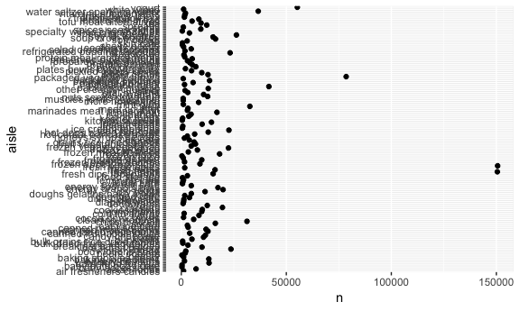

HW 3
================
Melanie Mayer
10/10/2018

Question 1
----------

``` r
brfss_data = brfss_smart2010 %>%
  janitor::clean_names() %>%
  filter(topic == "Overall Health") %>%
  separate(locationdesc, into = c("remove", "county"), sep = " - ") %>%
  select(-c(remove)) %>%
  rename(state = locationabbr) %>%
  mutate(response = factor(response))
  

brfss_data %>%
  filter(year == 2002) %>%
  distinct(county, .keep_all = T) %>%
  group_by(state) %>%
  summarize(n = n()) %>%
  filter(n == 7)
```

    ## # A tibble: 3 x 2
    ##   state     n
    ##   <chr> <int>
    ## 1 CT        7
    ## 2 FL        7
    ## 3 MA        7

``` r
brfss_data %>% 
  distinct(county, year, .keep_all = TRUE) %>%
  select(c(year, state, county)) %>%
  group_by(state, year) %>%
  summarize(locations = n()) %>%
  ggplot(aes(x = year, y = locations, color = state)) +
    geom_line()
```


``` r
brfss_data %>%
  filter(year %in% c(2002, 2006, 2010), state == "NY", response == "Excellent") %>%
  group_by(year, county) %>%
  summarize(mean = mean(data_value, na.rm = T),
            sd = sd(data_value, na.rm = T))
```

    ## # A tibble: 20 x 4
    ## # Groups:   year [?]
    ##     year county              mean    sd
    ##    <int> <chr>              <dbl> <dbl>
    ##  1  2002 Kings County        19.5    NA
    ##  2  2002 Nassau County       26.9    NA
    ##  3  2002 New York County     27.9    NA
    ##  4  2002 Queens County       18.8    NA
    ##  5  2002 Suffolk County      27.1    NA
    ##  6  2006 Kings County        19.2    NA
    ##  7  2006 Nassau County       21.7    NA
    ##  8  2006 New York County     28.8    NA
    ##  9  2006 Queens County       18.9    NA
    ## 10  2006 Suffolk County      20.6    NA
    ## 11  2006 Westchester County  26      NA
    ## 12  2010 Bronx County        17.6    NA
    ## 13  2010 Erie County         17.2    NA
    ## 14  2010 Kings County        22.4    NA
    ## 15  2010 Monroe County       22.4    NA
    ## 16  2010 Nassau County       26.2    NA
    ## 17  2010 New York County     25.8    NA
    ## 18  2010 Queens County       21.2    NA
    ## 19  2010 Suffolk County      24.6    NA
    ## 20  2010 Westchester County  26.9    NA

``` r
brfss_data %>%
  group_by(year, state, response) %>%
  summarize(mean = mean(data_value, na.rm = T)) %>%
  ggplot(aes(x = year, y = mean)) +
  geom_point(alpha = 0.5) +
  facet_grid(. ~ response)
```


Question 2
----------

This data consists of 1384617 observations over 15 variables.

There are 134 distinct isles.

``` r
instacart %>% 
  distinct(aisle_id) %>%
  nrow()
```

    ## [1] 134

``` r
instacart %>%
  group_by(aisle) %>%
  count(aisle) %>%
  arrange(-n) %>%
  head(5)
```

    ## # A tibble: 5 x 2
    ## # Groups:   aisle [5]
    ##   aisle                           n
    ##   <chr>                       <int>
    ## 1 fresh vegetables           150609
    ## 2 fresh fruits               150473
    ## 3 packaged vegetables fruits  78493
    ## 4 yogurt                      55240
    ## 5 packaged cheese             41699

``` r
instacart %>%
  group_by(aisle) %>%
  count() %>%
  ggplot(aes(x = aisle, y = n)) +
  geom_point() +
  coord_flip()
```



``` r
instacart %>%
  filter(aisle %in% c("baking ingredients", "dog food care", "packaged vegetables fruits")) %>%
  group_by(aisle) %>%
  count(product_name) %>%
  top_n(5) %>%
  knitr::kable()
```

    ## Selecting by n

| aisle                      | product\_name                                   |     n|
|:---------------------------|:------------------------------------------------|-----:|
| baking ingredients         | Cane Sugar                                      |   336|
| baking ingredients         | Light Brown Sugar                               |   499|
| baking ingredients         | Organic Vanilla Extract                         |   327|
| baking ingredients         | Premium Pure Cane Granulated Sugar              |   329|
| baking ingredients         | Pure Baking Soda                                |   387|
| dog food care              | Organix Chicken & Brown Rice Recipe             |    28|
| dog food care              | Organix Grain Free Chicken & Vegetable Dog Food |    24|
| dog food care              | Small Dog Biscuits                              |    26|
| dog food care              | Snack Sticks Chicken & Rice Recipe Dog Treats   |    30|
| dog food care              | Standard Size Pet Waste bags                    |    25|
| packaged vegetables fruits | Organic Baby Spinach                            |  9784|
| packaged vegetables fruits | Organic Blueberries                             |  4966|
| packaged vegetables fruits | Organic Grape Tomatoes                          |  3823|
| packaged vegetables fruits | Organic Raspberries                             |  5546|
| packaged vegetables fruits | Seedless Red Grapes                             |  4059|

``` r
instacart %>%
  filter(product_name %in% c("Pink Lady Apples", "Coffee Ice Cream")) %>%
  group_by(product_name, order_dow) %>%
  summarize(mean_time_of_day = mean(order_hour_of_day)) %>%
  spread(key = product_name, value = mean_time_of_day) %>%
  mutate(order_dow = order_dow + 1,
         order_dow = DescTools::day.name[order_dow]) %>%
  knitr::kable()
```

| order\_dow |  Coffee Ice Cream|  Pink Lady Apples|
|:-----------|-----------------:|-----------------:|
| Monday     |          13.77419|          13.44118|
| Tuesday    |          14.31579|          11.36000|
| Wednesday  |          15.38095|          11.70213|
| Thursday   |          15.31818|          14.25000|
| Friday     |          15.21739|          11.55172|
| Saturday   |          12.26316|          12.78431|
| Sunday     |          13.83333|          11.93750|
