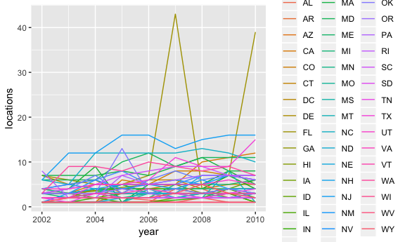
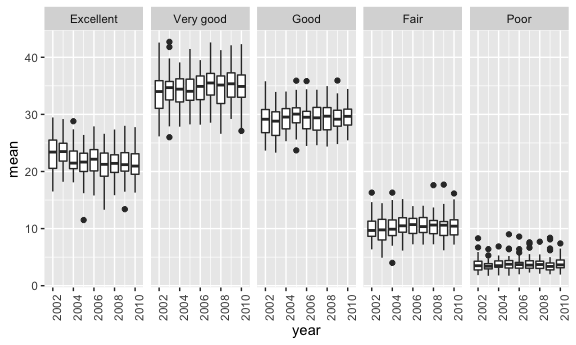
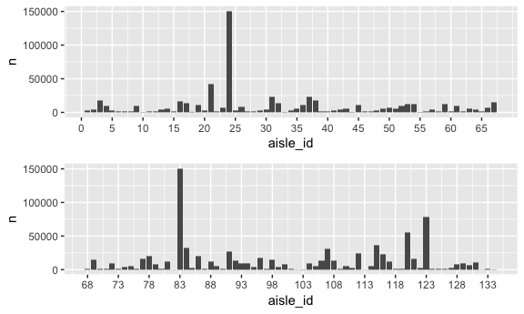
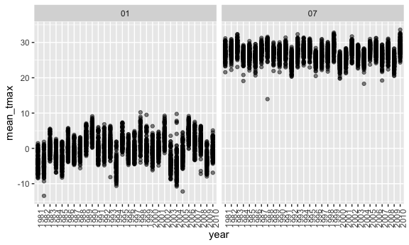
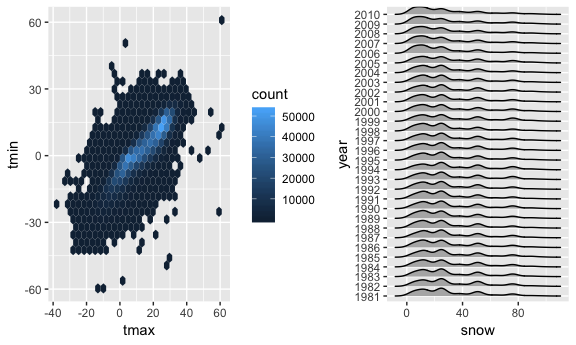

HW 3
================
Melanie Mayer
10/10/2018

Question 1
----------

``` r
brfss_data = brfss_smart2010 %>%
  janitor::clean_names() %>%
  filter(topic == "Overall Health") %>%
  separate(locationdesc, into = c("remove", "county"), sep = " - ") %>%
  select(-c(remove)) %>%
  rename(state = locationabbr) %>%
  mutate(response = factor(response, 
                           levels = c("Excellent", "Very good", "Good", "Fair", "Poor")))


brfss_data %>%
  filter(year == 2002) %>%
  distinct(county, .keep_all = T) %>%
  group_by(state) %>%
  summarize(n = n()) %>%
  filter(n == 7) %>%
  knitr::kable()
```

| state |    n|
|:------|----:|
| CT    |    7|
| FL    |    7|
| MA    |    7|

The table above shows the only states which had data on exactly seven counties in 2002.

``` r
brfss_data %>% 
  distinct(county, year, .keep_all = TRUE) %>%
  select(c(year, state, county)) %>%
  group_by(state, year) %>%
  summarize(locations = n()) %>%
  ggplot(aes(x = year, y = locations, color = state)) +
    geom_line()
```



This plot does not seem to be a good choice for this data set. It is hard to enterpret anything from the graphic, it may be better to try and look into each state on its own rather than comparing them all on one plot. There is one state that is above all the rest in 2007, but this graph does not even allow us to know which state that is. We can see that the states vary a lot from one another. This may have to do with the different sizes of each state. It may be useful to control for size in order for states to be comparable, depending on what information we are trying to extract.

``` r
brfss_data %>%
  filter(year %in% c(2002, 2006, 2010), state == "NY", response == "Excellent") %>%
  group_by(year) %>%
  summarize(mean = mean(data_value, na.rm = T),
            sd = sd(data_value, na.rm = T)) %>%
  knitr::kable()
```

|  year|      mean|        sd|
|-----:|---------:|---------:|
|  2002|  24.04000|  4.486424|
|  2006|  22.53333|  4.000833|
|  2010|  22.70000|  3.567212|

It appears the mean and the standard deviation of the proportion of "Excellent" responses accross locations in New York both decrease through the three years, although not by large amounts, especially the mean. The proportion of "Excellent" responses seems to be somewhat constant in New York, but may be on the decline.

``` r
brfss_data %>%
  group_by(year, state, response) %>%
  summarize(mean = mean(data_value, na.rm = T)) %>%
  ggplot(aes(x = year, y = mean, group = year)) +
  geom_boxplot() +
  theme(axis.text.x = element_text(angle = 90, hjust = 1)) +
  facet_grid(. ~ response)
```



The average proprtion in each response category per state appears to be consistant accross all the years with few outliers. The "Poor" category does appear to have a smaller spread and many more outliers compared to the other categories, but it is still consistant from years 2002 to 2010. The five categories differ very highly from one another however.

Question 2
----------

This data consists of 1384617 observations over 15 variables.

This data set is giving us information on the sales from instacart, telling us what items have been sold with information on the sale such as which isle and departmetn the item bought is from, the time and date it was sold on, and whether this was bought before or not. For example, it tells us that garlic couscous was bought from the instant food isles in the dry goods pasta departmenton Saturday (assuming 6 day of week refers to Saturday) at 3PM.

``` r
instacart %>%
  group_by(aisle) %>%
  count(aisle) %>%
  arrange(-n) %>%
  head(5) %>%
  knitr::kable()
```

| aisle                      |       n|
|:---------------------------|-------:|
| fresh vegetables           |  150609|
| fresh fruits               |  150473|
| packaged vegetables fruits |   78493|
| yogurt                     |   55240|
| packaged cheese            |   41699|

There are 134 distinct isles.

Above tells us which aisles are ordered from the most. It is interesting to see that fresh fruits and vegetables are bought a lot more than from any other aisle, almost double in the amount of orders compared to the next most bought aisle.

``` r
instacart_plot1 = instacart %>%
  mutate(aisle_id = factor(aisle_id, levels = c(1:134))) %>%
  filter(aisle_id %in% c(1:67)) %>%
  mutate(aisle_id = as.numeric(aisle_id)) %>%
  group_by(aisle_id) %>%
  count() %>%
  ggplot(aes(x = aisle_id, y = n)) +
  geom_bar(stat = "identity") +
  scale_x_continuous(breaks = seq(0, 67, 5))


instacart_plot2 = instacart %>%
  mutate(aisle_id = factor(aisle_id, levels = c(1:134))) %>%
  filter(aisle_id %in% c(68:134)) %>%
  mutate(aisle_id = as.numeric(aisle_id)) %>%
  group_by(aisle_id) %>%
  count() %>%
  ggplot(aes(x = aisle_id, y = n)) +
  geom_bar(stat = "identity") +
  scale_x_continuous(breaks = seq(68, 134, 5))

instacart_plot1 / instacart_plot2
```



Above we can see the number of items ordered in each aisle. It is difficult to order aisles sensibly and make it readable due to the sheer amount of aisles. In order to try and maxamize readability, I used aisle ID instead of name. Although this does not make it interpritable off the bat it is easy to go back to the data set and see what each number is referig to. Dividing the plot into two also makes it easier to read what number pertains to which bar. Here we see that 24 and 83 are very high. Looking into these numbers tells us that these are the aisles for fresh fruit and fresh vegetables, which matches with our previous table.

``` r
instacart %>%
  filter(aisle %in% c("baking ingredients", "dog food care", "packaged vegetables fruits")) %>%
  group_by(aisle) %>%
  count(product_name) %>%
  top_n(5) %>%
  knitr::kable()
```

    ## Selecting by n

| aisle                      | product\_name                                   |     n|
|:---------------------------|:------------------------------------------------|-----:|
| baking ingredients         | Cane Sugar                                      |   336|
| baking ingredients         | Light Brown Sugar                               |   499|
| baking ingredients         | Organic Vanilla Extract                         |   327|
| baking ingredients         | Premium Pure Cane Granulated Sugar              |   329|
| baking ingredients         | Pure Baking Soda                                |   387|
| dog food care              | Organix Chicken & Brown Rice Recipe             |    28|
| dog food care              | Organix Grain Free Chicken & Vegetable Dog Food |    24|
| dog food care              | Small Dog Biscuits                              |    26|
| dog food care              | Snack Sticks Chicken & Rice Recipe Dog Treats   |    30|
| dog food care              | Standard Size Pet Waste bags                    |    25|
| packaged vegetables fruits | Organic Baby Spinach                            |  9784|
| packaged vegetables fruits | Organic Blueberries                             |  4966|
| packaged vegetables fruits | Organic Grape Tomatoes                          |  3823|
| packaged vegetables fruits | Organic Raspberries                             |  5546|
| packaged vegetables fruits | Seedless Red Grapes                             |  4059|

The table shows popular items within the three specific aisles. It tells us that, as we would expect and seen before, "packaged vegetable fruits" top items are bought a lot more than baking ingredients and dog food care.

``` r
instacart %>%
  filter(product_name %in% c("Pink Lady Apples", "Coffee Ice Cream")) %>%
  group_by(product_name, order_dow) %>%
  summarize(mean_time_of_day = mean(order_hour_of_day)) %>%
  spread(key = product_name, value = mean_time_of_day) %>%
  mutate(order_dow = order_dow + 1,
         order_dow = DescTools::day.name[order_dow]) %>%
  knitr::kable()
```

| order\_dow |  Coffee Ice Cream|  Pink Lady Apples|
|:-----------|-----------------:|-----------------:|
| Monday     |          13.77419|          13.44118|
| Tuesday    |          14.31579|          11.36000|
| Wednesday  |          15.38095|          11.70213|
| Thursday   |          15.31818|          14.25000|
| Friday     |          15.21739|          11.55172|
| Saturday   |          12.26316|          12.78431|
| Sunday     |          13.83333|          11.93750|

I am assuming day 0 is referring to Monday in this data set, if not then each day will be moved one down with Sunday at the top.

Our table shows that during the week coffee ice cream is bought at a later time that on the weekends. Pink Lady Apples, on the other hand, don't follow a specific pattern but are bought more on the weekends.

Question 3
----------

This data consists of 2595176 observations over 7 variables.

The data is giving us information on the weather from New York weather stations from years 1981 - 2010 by day. It tells us the date, the precipitation, the snow and snow depth, and the minimum and max temperature for that day (in tenths of degrees celsius). There are many NAs in this data set, most likely a result of poor data collection at the weather stations. This may create bias results.

``` r
ny_noaa_clean = ny_noaa %>%
  janitor::clean_names() %>%
  separate(date, into = c("year", "month", "day"), sep = "-") %>%
  mutate(year = factor(year),
         tmax = as.numeric(tmax)/10, 
         tmin = as.numeric(tmin)/10,
         prcp = prcp/10)

ny_noaa_clean %>%
  count(snow) %>%
  top_n(5) %>%
  knitr::kable()
```

    ## Selecting by n

|  snow|        n|
|-----:|--------:|
|     0|  2008508|
|    13|    23095|
|    25|    31022|
|    51|    18274|
|    NA|   381221|

In the data cleaning process I divided the date into its three components and converted the character vectors into numeric. I divided tmax, tmin, and prcp by ten because the data set is giving these values as tenths of the understandable unit (celsius and mm) and by dividing it is much more interpretable.

The most commonly observed values for snow are 0 and NA. 0 should be observed the most because there are many days in a year where it does not rain in New York, represeted by zero. The NAs, however, are a result of poor compilation from the weather stations and are unfortunate.

``` r
ny_noaa_clean %>%
  filter(month %in% c("01", "07")) %>%
  group_by(month, id, year) %>%
  summarize(mean_tmax = mean(tmax, na.rm = TRUE)) %>%
  ggplot(aes(x = year, y = mean_tmax)) +
    geom_point(alpha = 0.5) +
    theme(axis.text.x = element_text(angle = 90)) +
    facet_grid(. ~ month)
```

    ## Warning: Removed 5970 rows containing missing values (geom_point).



The plot tells us that the max temperature is much higher in July compared to January, which is to be expected. There does seem to be a lot of variation from year to year however in average max temperatures. More then that it is hard to interpret too much from the graphic. There are many outliers, this can be a result from inaccurate recordings or simply a strange day.

``` r
tmax_vs_tmin = ny_noaa_clean %>%
  ggplot(aes(x = tmax, y = tmin)) +
  geom_hex()

snow_per_year = ny_noaa_clean %>%
  filter(snow %in% c(1:99)) %>%
  ggplot(aes(x = snow, y = year)) +
  geom_density_ridges(scale = .85)

tmax_vs_tmin + snow_per_year
```

    ## Warning: Removed 1136276 rows containing non-finite values (stat_binhex).

    ## Picking joint bandwidth of 3.76



The first plot shows that there are two higher density combinations of tmax and tmin. We also see that there are a few outliers. The particularly alarming point is the 60/60 point, which seems like it must be an error in the recording of temperature.

The second plot shows the distributions of snow through the years. It appears that it is pretty constant accross all the years with few variations. The higher density occurs around 12 mm and 24 mm with another smaller accumulation of density at around 45 mm of snow and 75 mm.
