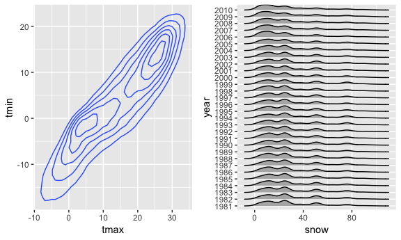

HW 3
================
Melanie Mayer
10/10/2018

Question 1
----------

``` r
brfss_data = brfss_smart2010 %>%
  janitor::clean_names() %>%
  filter(topic == "Overall Health") %>%
  separate(locationdesc, into = c("remove", "county"), sep = " - ") %>%
  select(-c(remove)) %>%
  rename(state = locationabbr) %>%
  mutate(response = factor(response, 
                           levels = c("Excellent", "Very good", "Good", "Fair", "Poor")))


brfss_data %>%
  filter(year == 2002) %>%
  distinct(county, .keep_all = T) %>%
  group_by(state) %>%
  summarize(n = n()) %>%
  filter(n == 7) %>%
  knitr::kable()
```

| state |    n|
|:------|----:|
| CT    |    7|
| FL    |    7|
| MA    |    7|

``` r
#During 2002, the only three states which had data on exactly seven counties were Connecticut, Florida, and Massachusetts


brfss_data %>% 
  distinct(county, year, .keep_all = TRUE) %>%
  select(c(year, state, county)) %>%
  group_by(state, year) %>%
  summarize(locations = n()) %>%
  ggplot(aes(x = year, y = locations, color = state)) +
    geom_line()
```


``` r
#This plot does not seem to be a good choice for this data set. It is hard to enterpret anything from the graphic, it may be better to try and look into each state on its own rather than comparing them all on one plot.


brfss_data %>%
  filter(year %in% c(2002, 2006, 2010), state == "NY", response == "Excellent") %>%
  group_by(year) %>%
  summarize(mean = mean(data_value, na.rm = T),
            sd = sd(data_value, na.rm = T)) %>%
  knitr::kable()
```

|  year|      mean|        sd|
|-----:|---------:|---------:|
|  2002|  24.04000|  4.486424|
|  2006|  22.53333|  4.000833|
|  2010|  22.70000|  3.567212|

``` r
#It appears the mean did not change too much through the years, the standard deviation does however decrease.

brfss_data %>%
  group_by(year, state, response) %>%
  summarize(mean = mean(data_value, na.rm = T)) %>%
  ggplot(aes(x = year, y = mean)) +
  geom_point(alpha = 0.5) +
  theme(axis.text.x = element_text(angle = 50, hjust = 1)) +
  facet_grid(. ~ response)
```


``` r
#The proportion per each response appears to be consistant accross all the years
```

Question 2
----------

This data consists of 1384617 observations over 15 variables.

There are 134 distinct isles.

``` r
instacart %>% 
  distinct(aisle_id) %>%
  nrow()
```

    ## [1] 134

``` r
instacart %>%
  group_by(aisle) %>%
  count(aisle) %>%
  arrange(-n) %>%
  head(5) %>%
  knitr::kable()
```

| aisle                      |       n|
|:---------------------------|-------:|
| fresh vegetables           |  150609|
| fresh fruits               |  150473|
| packaged vegetables fruits |   78493|
| yogurt                     |   55240|
| packaged cheese            |   41699|

``` r
instacart_plot1 = instacart %>%
  mutate(aisle_id = factor(aisle_id, levels = c(1:134))) %>%
  filter(aisle_id %in% c(1:67)) %>%
  mutate(aisle_id = as.numeric(aisle_id)) %>%
  group_by(aisle_id) %>%
  count() %>%
  ggplot(aes(x = aisle_id, y = n)) +
  geom_point() +
  scale_x_continuous(breaks = seq(0, 67, 5))


instacart_plot2 = instacart %>%
  mutate(aisle_id = factor(aisle_id, levels = c(1:134))) %>%
  filter(aisle_id %in% c(68:134)) %>%
  mutate(aisle_id = as.numeric(aisle_id)) %>%
  group_by(aisle_id) %>%
  count() %>%
  ggplot(aes(x = aisle_id, y = n)) +
  geom_point() +
  scale_x_continuous(breaks = seq(68, 134, 5))

instacart_plot1 / instacart_plot2
```


``` r
instacart %>%
  filter(aisle %in% c("baking ingredients", "dog food care", "packaged vegetables fruits")) %>%
  group_by(aisle) %>%
  count(product_name) %>%
  top_n(5) %>%
  knitr::kable()
```

    ## Selecting by n

| aisle                      | product\_name                                   |     n|
|:---------------------------|:------------------------------------------------|-----:|
| baking ingredients         | Cane Sugar                                      |   336|
| baking ingredients         | Light Brown Sugar                               |   499|
| baking ingredients         | Organic Vanilla Extract                         |   327|
| baking ingredients         | Premium Pure Cane Granulated Sugar              |   329|
| baking ingredients         | Pure Baking Soda                                |   387|
| dog food care              | Organix Chicken & Brown Rice Recipe             |    28|
| dog food care              | Organix Grain Free Chicken & Vegetable Dog Food |    24|
| dog food care              | Small Dog Biscuits                              |    26|
| dog food care              | Snack Sticks Chicken & Rice Recipe Dog Treats   |    30|
| dog food care              | Standard Size Pet Waste bags                    |    25|
| packaged vegetables fruits | Organic Baby Spinach                            |  9784|
| packaged vegetables fruits | Organic Blueberries                             |  4966|
| packaged vegetables fruits | Organic Grape Tomatoes                          |  3823|
| packaged vegetables fruits | Organic Raspberries                             |  5546|
| packaged vegetables fruits | Seedless Red Grapes                             |  4059|

``` r
instacart %>%
  filter(product_name %in% c("Pink Lady Apples", "Coffee Ice Cream")) %>%
  group_by(product_name, order_dow) %>%
  summarize(mean_time_of_day = mean(order_hour_of_day)) %>%
  spread(key = product_name, value = mean_time_of_day) %>%
  mutate(order_dow = order_dow + 1,
         order_dow = DescTools::day.name[order_dow]) %>%
  knitr::kable()
```

| order\_dow |  Coffee Ice Cream|  Pink Lady Apples|
|:-----------|-----------------:|-----------------:|
| Monday     |          13.77419|          13.44118|
| Tuesday    |          14.31579|          11.36000|
| Wednesday  |          15.38095|          11.70213|
| Thursday   |          15.31818|          14.25000|
| Friday     |          15.21739|          11.55172|
| Saturday   |          12.26316|          12.78431|
| Sunday     |          13.83333|          11.93750|

Question 3
----------

``` r
ny_noaa_clean = ny_noaa %>%
  janitor::clean_names() %>%
  separate(date, into = c("year", "month", "day"), sep = "-") %>%
  mutate(year = factor(year),
         tmax = as.integer(tmax), 
         tmin = as.integer(tmin))

ny_noaa_clean %>%
  count(snow) %>%
  top_n(5) %>%
  knitr::kable()
```

    ## Selecting by n

|  snow|        n|
|-----:|--------:|
|     0|  2008508|
|    13|    23095|
|    25|    31022|
|    51|    18274|
|    NA|   381221|

``` r
ny_noaa_clean %>%
  filter(month %in% c("01", "07")) %>%
  group_by(month, id, year) %>%
  summarize(mean_tmax = mean(tmax, na.rm = TRUE)) %>%
  ggplot(aes(x = year, y = mean_tmax)) +
    geom_point(alpha = 0.5) +
    theme(axis.text.x = element_text(angle = 75, hjust = 1)) +
    facet_grid(. ~ month)
```

    ## Warning: Removed 5970 rows containing missing values (geom_point).


``` r
tmax_vs_tmin = ny_noaa_clean %>%
  ggplot(aes(x = tmax, y = tmin)) +
  geom_point()

snow_per_year = ny_noaa_clean %>%
  filter(snow %in% c(1:99)) %>%
  group_by(year) %>%
  ggplot(aes(x = snow)) +
  geom_histogram()

tmax_vs_tmin + snow_per_year
```

    ## Warning: Removed 1136276 rows containing missing values (geom_point).

    ## `stat_bin()` using `bins = 30`. Pick better value with `binwidth`.


